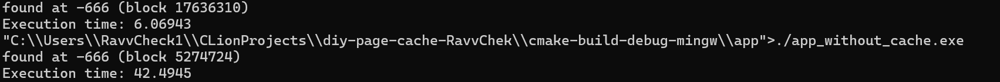
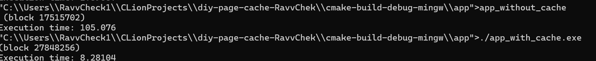

# Лабораторная работа №2 по ОС
***
## Отчёт
***Выполнил: Баянов Равиль Динарович P3334***  
***Преподаватель: Смирнов Виктор Игоревич***  
***Вариант: Windows Second-Chance***
***

## Задание
Для оптимизации работы с блочными устройствами в ОС существует кэш страниц с данными, которыми мы производим операции чтения и записи на диск. Такой кэш позволяет избежать высоких задержек при повторном доступе к данным, так как операция будет выполнена с данными в RAM, а не на диске (вспомним пирамиду памяти).

В данной лабораторной работе необходимо реализовать блочный кэш в пространстве пользователя в виде динамической библиотеки (dll или so). Политику вытеснения страниц и другие элементы задания необходимо получить у преподавателя.

При выполнении работы необходимо реализовать простой API для работы с файлами, предоставляющий пользователю следующие возможности:

Открытие файла по заданному пути файла, доступного для чтения. Процедура возвращает некоторый хэндл на файл. Пример:
`int lab2_open(const char *path)`.
 
Закрытие файла по хэндлу. Пример:
`int lab2_close(int fd)`.
 
Чтение данных из файла. Пример:
`ssize_t lab2_read(int fd, void buf[.count], size_t count)`. 
Запись данных в файл. Пример:
`ssize_t lab2_write(int fd, const void buf[.count], size_t count)`.  
Перестановка позиции указателя на данные файла. Достаточно поддержать только абсолютные координаты. Пример:
`off_t lab2_lseek(int fd, off_t offset, int whence)`.  
 Синхронизация данных из кэша с диском. Пример:
`int lab2_fsync(int fd)`.

Операции с диском разработанного блочного кеша должны производиться в обход page cache используемой ОС.

В рамках проверки работоспособности разработанного блочного кэша необходимо адаптировать указанную преподавателем программу-загрузчик из ЛР 1, добавив использование кэша. Запустите программу и убедитесь, что она корректно работает. Сравните производительность до и после.

## Ограничения
* Программа (комплекс программ) должна быть реализован на языке C или C++.
* Если по выданному варианту задана политика вытеснения Optimal, то необходимо предоставить пользователю возможность подсказать `page cache`, когда будет совершен следующий доступ к данным. Это можно сделать либо добавив параметр в процедуры `read` и `write` (например, `ssize_t lab2_read(int fd, void buf[.count], size_t count, access_hint_t hint))`, либо добавив еще одну функцию в API (например, `int lab2_advice(int fd, off_t offset, access_hint_t hint))`. `access_hint_t` в данном случае – это абсолютное время или временной интервал, по которому разработанное API будет определять время последующего доступа к данным.
* Запрещено использовать высокоуровневые абстракции над системными вызовами. Необходимо использовать, в случае Unix, процедуры libc.

***
## Обзор кода
* `SecondChanceCache.cpp`, `SecondChanceCache.h` - реализация чтения и записи данных из файла и в файл с помощью кэша по принципу Second Chance. [SecondChanceCache.cpp](./SecondChanceCache/SecondChanceCache.cpp), [SecondChanceCache.h](./SecondChanceCache/SecondChanceCache.h).
* `API.cpp`, `API.h` - реализация dll библиотеки для работы с файлами при поддержке кэша, написанного в `SecondChanceCache.cpp`. [API.cpp](./SecondChanceCache/API.cpp), [API.h](./SecondChanceCache/API.h).
* `ema-search-int.cpp`, `ema-search-int.h` - реализация программ-нагрузчиков из БЛР1 для сравнения скорости выполнения алгоритма с кэшом и без. [ema-search-int.cpp](./app/ema-search-int.cpp), [ema-search-int.h](./app/ema-search-int.h).
* `app-with-cache.cpp`, `app_without_cache.cpp` - программы (.exe) для запуска из `shell`. [app_with_cache.cpp](./app/app_with_cache.cpp), [app_without_cache.cpp](./app/app_without_cache.cpp).

***
## Данные о работе программы-нагрузчика до и после внедрения `page cache`
Запустим с помощью `MyShell` из БЛР1 наши программы-нагрузчики с кэшом и без кэша. 
Сначала я получил неудовлетворительный результат:

 
Алгоритм без кэша работает примерно в два раза быстрее, чем с кэшом.  
Как выяснилось, связано это с тем, что алгоритм `ema-search-int` изначально сам по себе искал число последовательно во всём файле. В таком случае логично, что мы не выйдем в плюс. Потому что мы каждый раз получаем всё новые и новые страницы. Кэщ затрачивает много времени на вставку новых страниц и удаление старых, поэтому мы проиграли.
 
Но сейчас мы попробуем доказать работоспособность написанного мной кэша.
Попробуем искать число в файле не последовательно, а рандомно вытягивая страницы из файла.
 

Теперь с таким подходом к поиску элемента мы наблюдаем прирост в скорости работы с кэшом примерно в 7 раз. Что крайне много.
 
Для наглядности приведу ещё один пример, где прирост в скорости ещё больше, чем в предыдущем.

 
Здесь разница между алгоритмом с кэшом и без почти в 13 раз!
 
И при последующих наблюдениях можно заметить, что алгоритм с кэшом работает стабильно быстро, а без кэша может выполняться невыносимо долго!

***
## Вывод
Выполнив данную лабораторную работу, я написал свой кэш по алгоритму Second Chance (Clock)
и получил удивительный прирост производительности своего алгоритма `ema-search-int`. Также для себя подметил, что 
использование кэша не всегда даёт положительный эффект. Очевидно, что для некоторых алгоритмов и процессов, кэш наоборот вредит работе, так как
кэш сам по себе может тратить очень много времени на вытеснение устаревшего элемента из кэша и на добавление нового элемента. Но 
при качесвтенной реализации и при правильном использовании кэш становится незаменимым в работе процессора и памяти.
